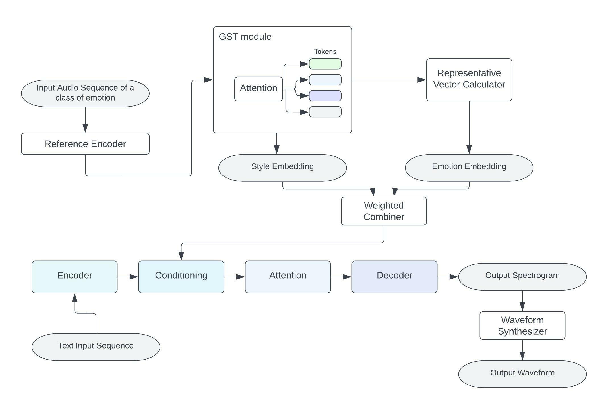

# Deep Learning based Speech Synthesis with Emotion Overlay

This paper proposes a Text-to-Speech System that synthesizes emotional speech. We have identified the lack of style diversity within audios produced for the same emotion, and have thus, come up with techniques of combining emotion embeddings with style embeddings in a novel weighted-controlled manner to produce speech with style varying based on target speakers and emotion depending on the emotion-category specified. We also provide different model variations which suggest different methods of injecting emotion embeddings into the TTS and various tactics of combining them with style embeddings. Tests conducted on our model variation which overlays emotion embeddings on the encoder outputs during inference and combines them with style embeddings in a 3:7 weight-ratio as per our novel approach gives a Mean Opinion Score of 3.612 which shows the more-than-satisfactory performance of our models in synthesizing style varying emotional speech.

## Architecture

## Testing on custom inputs
1. Clone the repository and download all the dependencies listed in the requirements.py file
2. In the command line, navigate into the 'test/' folder.
3. Run the command: "streamlit run app_f.py"
4. A streamlit website will open.
5. Click on the 'App' button.
6. Then choose your audio, gender of the speaker, and emotion (in that order). (You can choose more than one samples at once)
7. Click on 'Generate audio'. After listening to it, you can additionally download it.
